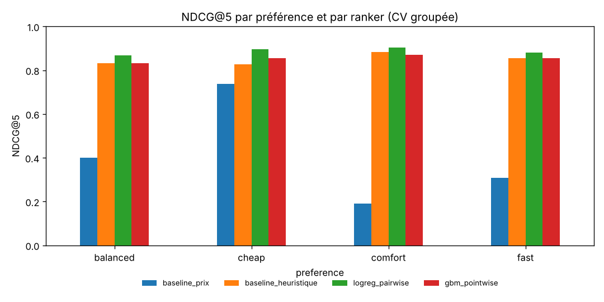

# Travel Search Agent – Recherche et ranking de voyages par un agent LLM

Un agent IA qui comprend une demande de voyage en langage naturel, interroge un catalogue de vols et
d'hôtels en **SQL**, **classe les options avec un modèle de ranking appris** et rédige une
recommandation **ancrée** (le LLM ne peut citer que des options réellement trouvées).

> « Un vol direct Paris-Lisbonne fin mai, le moins cher possible, avec 3 nuits d'hôtel près du centre »

Ce projet porte sur les briques d'une infrastructure de voyage pour agents IA : **recherche**,
**ranking**, **recommandation**, conception d'**expériences**, **baselines**, **métriques** et analyse d'erreurs.

## Architecture

```
 requête ──> parse (LLM → TravelRequest JSON validé)
               │ champ manquant / ville inconnue ──> clarify ──> question à l'utilisateur
               v
          search_flights (SQL paramétré, contraintes dures : dates, budget, escales)
               │ 0 résultat ──> no_result ──> suggestion d'élargir la recherche
               v
          rank (ranker appris, features relatives à la requête) ──> top 5
               v
          search_hotels (SQL, si des nuits sont demandées)
               v
          respond (LLM) ──> garde-fou : identifiants inventés rejetés, repli sur le top du ranker
```

Orchestration avec **LangGraph**, LLM **OpenAI ou Mistral** (sorties JSON validées par Pydantic avec
auto-correction), catalogue **SQLite** (81 208 vols, 500 hôtels, 20 villes, avril-mai 2027).

## Expérience de ranking

**Question :** un modèle appris classe-t-il mieux les vols qu'un tri par prix ou qu'une heuristique écrite à la main ?

**Données de pertinence.** Il n'y a pas de clics réels. On simule donc des voyageurs dont l'utilité
dépend de leur préférence déclarée (`cheap`, `fast`, `comfort`, `balanced`) et de **poids personnels
cachés** (bruit log-normal), plus un bruit de Gumbel. La pertinence (0 à 3) est déduite du rang
d'utilité dans chaque requête. Les modèles ne voient que des features observables :
prix et durée relatifs, escales, note de la compagnie, écart au créneau horaire, préférence.

**Protocole.** 963 requêtes, 12 179 options. Validation croisée **groupée par requête** (GroupKFold, 5 folds) :
toutes les options d'une même recherche sont dans le même fold. Les features étant relatives à la
requête (prix / prix minimum de la liste), un split par ligne ferait fuiter de l'information.

| Ranker | NDCG@5 | MRR | P@5 (pertinence ≥ 2) |
|---|---|---|---|
| Tri par prix | 0,406 ± 0,026 | 0,313 | 0,254 |
| Heuristique (poids fixes par préférence) | 0,850 ± 0,009 | 0,678 | 0,542 |
| Gradient boosting pointwise | 0,853 ± 0,009 | 0,685 | 0,542 |
| **Régression logistique pairwise (RankNet linéaire)** | **0,888 ± 0,007** | **0,734** | **0,564** |

P@5 est plafonnée à 0,6 : seules 3 options par requête ont une pertinence ≥ 2.



Ce qu'on en retient :
- Le **tri par prix** ne fonctionne que pour les voyageurs `cheap` (0,74). Il s'effondre pour `comfort` (0,19).
- Le **pairwise** bat le **pointwise** : apprendre l'ordre relatif entre deux options d'une même requête
  correspond mieux au problème que régresser une note absolue. Les interactions préférence × attributs
  permettent à un modèle linéaire d'adapter ses poids à chaque type de voyageur.
- Le modèle final (choisi automatiquement sur le NDCG@5 en CV) est réentraîné sur toutes les requêtes et utilisé par l'agent.

## Évaluation de l'extraction par le LLM

`data/parser_eval.jsonl` contient 20 demandes annotées à la main : dates relatives (« fin mai »),
budget, escales, créneau, hôtel, villes manquantes. Métriques : exactitude par champ, requêtes
parfaitement extraites, et détection des champs manquants (qui déclenchent une clarification).

| Modèle | Requêtes parfaitement extraites | Détection des champs manquants | Latence médiane |
|---|---|---|---|
| `gpt-4o-mini` | _à compléter_ | _à compléter_ | _à compléter_ |

> `python -m travel_agent.evaluate_parser`, résultats dans `reports/parser_metrics.json` et erreurs dans `reports/parser_errors.csv`.

## Installation et utilisation

```bash
git clone https://github.com/leg234-png/travel-search-agent.git
cd travel-search-agent
python -m venv .venv && source .venv/bin/activate
pip install -r requirements.txt
cp .env.example .env                    # renseigner la clé OpenAI ou Mistral

python -m travel_agent.catalog          # construit data/travel.db (≈ 2 s)
python -m travel_agent.train_ranker     # expérience de ranking + modèle final (≈ 10 s)
python -m travel_agent.evaluate_parser  # évaluation de l'extraction par le LLM
python -m travel_agent.cli "Un vol direct Paris-Lisbonne fin mai, le moins cher possible, avec 3 nuits d'hôtel près du centre"
pytest -q                               # tests sans réseau (faux LLM)
```

## Structure

```
travel_agent/
  catalog.py          génération du catalogue SQLite (vols, hôtels, villes)
  tools.py            outils de l'agent : requêtes SQL paramétrées
  schemas.py          TravelRequest, Recommendation, AgentAnswer (Pydantic)
  ranking.py          features, utilisateurs simulés, baselines, rankers appris, NDCG / MRR / P@k
  train_ranker.py     validation croisée groupée, rapport, sauvegarde du meilleur modèle
  agent.py            graphe LangGraph : parse → search → rank → hotels → respond
  evaluate_parser.py  évaluation de l'extraction LLM sur un jeu annoté
  llm.py              client OpenAI / Mistral avec sorties JSON validées
tests/                tests SQL, métriques, ranker, chemins de l'agent (clarification, 0 résultat, garde-fou)
```

## Limites et pistes

- La pertinence est **simulée**. Avec des logs réels, il faudrait corriger le biais de position des clics
  (ex. inverse propensity weighting) et évaluer en ligne (A/B test).
- Les hôtels sont classés par un score simple. Prochaine étape : le même protocole de ranking appris.
- Pistes : LambdaMART (LightGBM), features de prix contextuel (prix vs historique de la route),
  combinaison vol + hôtel optimisée sous budget global.

## Auteur

Emmanuel Wandji – ENSTA, Institut Polytechnique de Paris ·
[LinkedIn](https://www.linkedin.com/in/emmanuel-wandji) · [GitHub](https://github.com/leg234-png)
